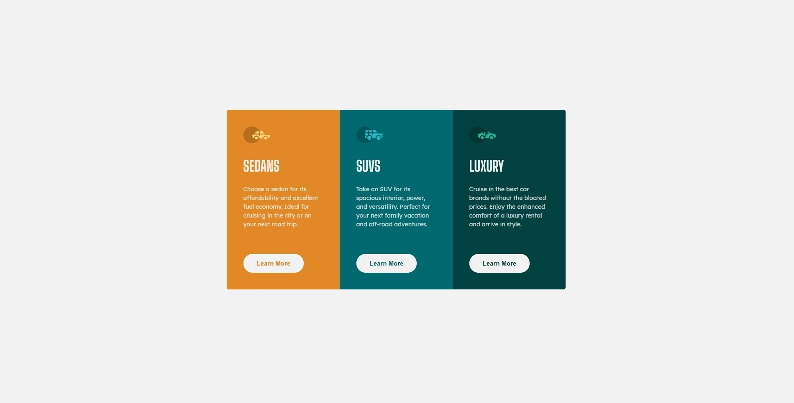
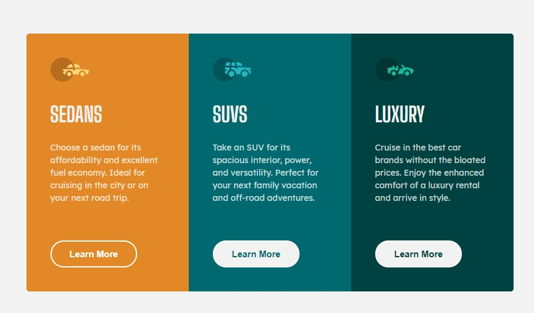

# Frontend Mentor - 3-column preview card component solution

Hello I'm Daniel, this is my solution to the [3-column preview card component challenge on Frontend Mentor](https://www.frontendmentor.io/challenges/3column-preview-card-component-pH92eAR2-). Frontend Mentor challenges help you improve your coding skills by building realistic projects. 

## Table of contents

- [Overview](#overview)
  - [The challenge](#the-challenge)
  - [Screenshot](#screenshot)
  - [Links](#links)
  - [Built with](#built-with)
  - [What I learned](#what-i-learned)
  - [Continued development](#continued-development)
- [Author](#author)

## Overview

The challenge is to make a 3-column preview card component that will help you as a newbie frontend developer. This challenge will improve your skills and make you more comfortable in building projects as a newbie.

### The challenge

Users should be able to:

- View the optimal layout depending on their device's screen size
- See hover states for interactive elements

### Screenshot

All screenshots can be found in the screenshots folder

### Links

- Solution URL: [Github files](https://github.com/dalandadan/Challenge_3-column-preview-card)
- Live Site URL: [Live site](https://kind-rosalind-252acb.netlify.app)

### Built with

- Semantic HTML5 markup
- CSS custom properties
- Flexbox
- CSS Grid
- Mobile-first workflow

### What I learned

In this project I learned how to organize my workflow, coming up with a plan in mind that I will follow from start to end made me focus on the solutions step by step. I highly encourage the future challenge solver to do it as well.

### Conclusion

Even though my code is not that clean, overall I managed to accomplish the task and be able to make a responsive 3-column preview card component that have an interactive hover state.

## Author

- Frontend Mentor - [@dalandadan](https://www.frontendmentor.io/profile/dalandadan)
- Twitter - [@danlandadan](https://www.twitter.com/danlandadan)
